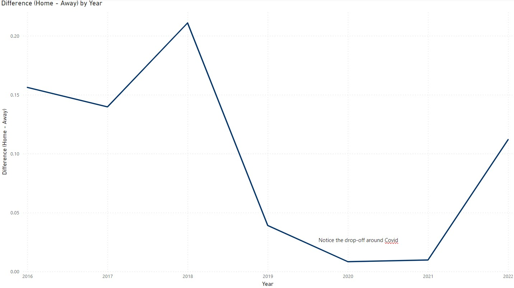
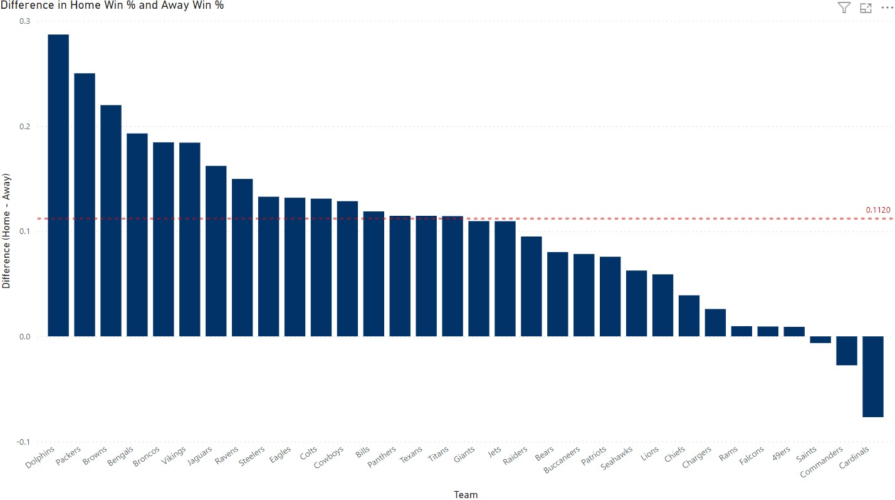
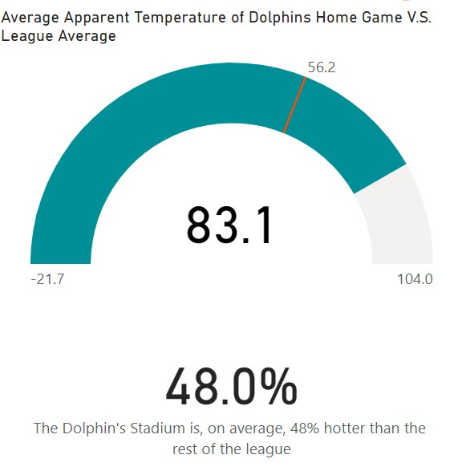
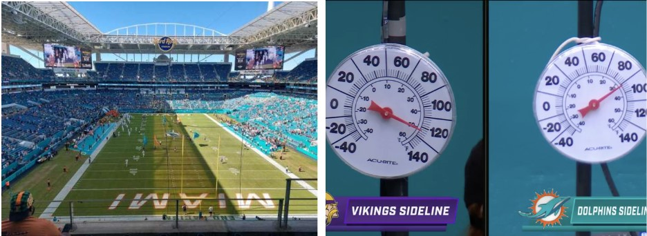
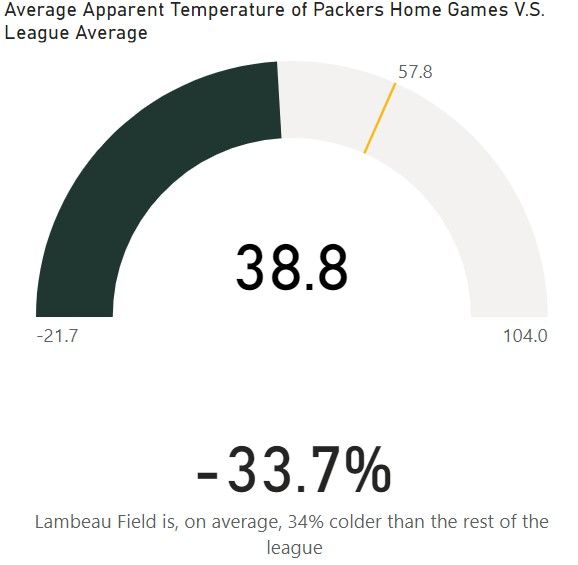

# NFL-Home
 
In this project, my goal is to use data analysis to determine where would be the best city to move or add a team to the NFL in order to maximize Home Field Advantage (HFA). I go through and break down what gives the teams with the highest HFA their HFA. The data was obtained from ESPN through web scraping with BS4. I created team cards in PowerBI that are attached to a MySQL database to breakdown my findings. Screenshots can be found [here](https://github.com/JeffSinsel/NFL-Home/tree/main/team-cards) or checkout NFL-Home.pbix to see the dashboard. 

## Home Field Advantage
In order to determine HFA, I took every team's home win percentage - their away win percentage to account for team strength. The time frame for this is 2016 to 2022 because 2016 was the year where 4 teams started changing stadiums. Here is the graph of overall HFA for every team in the league: 

As you can see, HFA varies from year to but remains in approximately the 5% to 20% range barring pandemics. This is often times reflected in betting odds for NFL games where if two equal teams play, the home team is favored. 

To know what teams to look toward for large HFA, we need to break this down by team which is shown here: 

This graph shows the [Dolphins](#dolphins) and [Packers](#packers) blowing away the league average of 11.2% HFA with 29% and 25% respectively. We also see the [Cardinals](#cardinals) who are significantly below 0% HFA with **-8%** showing a home field **disadvantage**. Two other teams worth noting are the [Browns](#browns) and [Broncos](#broncos) also being higher than average having a 22% and 18% HFA respectively. 

## Dolphins
The Dolphins play at Hard Rock Stadium, located in Miami, Florida. Because of the location, Hard Rock Stadium hosts, on average, the hottest home games compared to the rest of the league. 

They take extra advantage of the climate by having the away team bench on the north of the stadium facing south. This makes the away bench bake in the sun while the home bench is comfortably in the shade. 

Another small thing, the Dolphins wear white at home where traditionally the home team wears their primary color. This reduces the amount of sunlight the players absorb.

## Packers
The Packers play at Lambeau Field, located in Green Bay, Wisconsin. Lambeau Field is appropriately nicknamed "Frozen Tundra" because it is the exact opposite of Hard Rock Stadium. Lambeau Field hosts, on average, the coldest home games compared to the rest of the league. To add on to this, the average amount of snow in Green Bay is 562% league average.

This advantage kicks in harder during the playoffs which happen in January, leading to a **21-6** home playoff record.

## Browns

## Broncos

## Cardinals