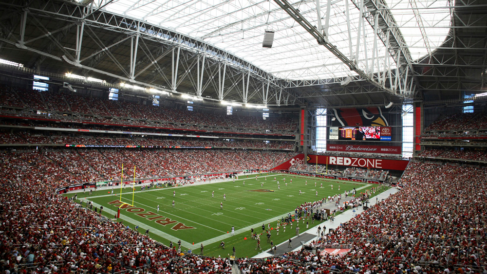
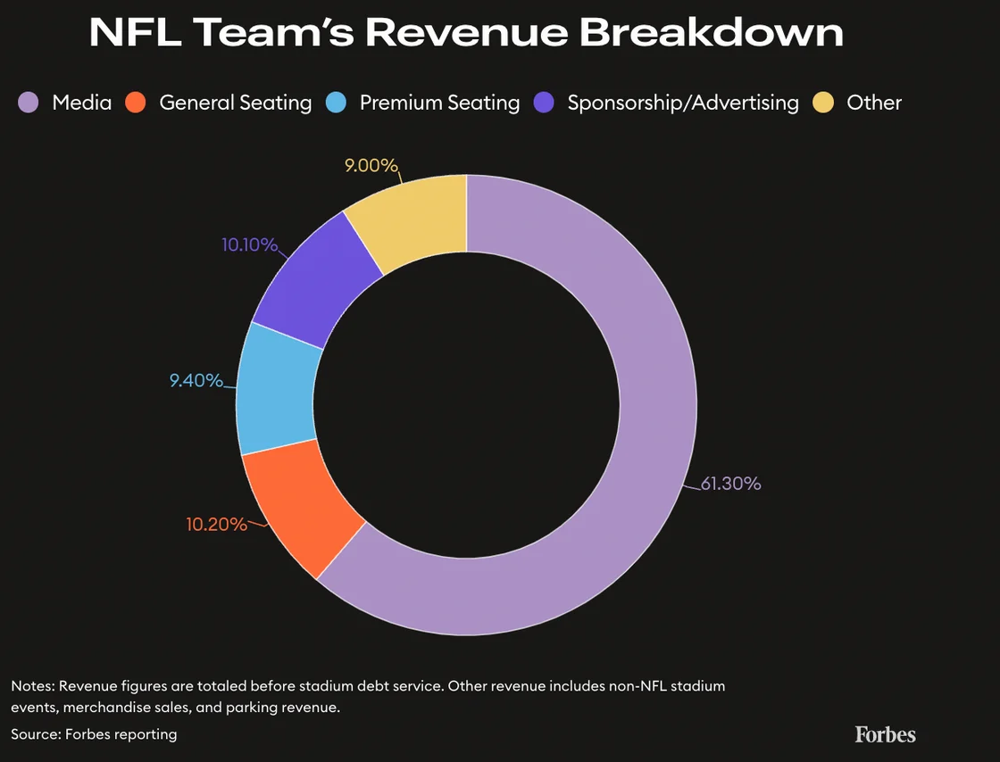
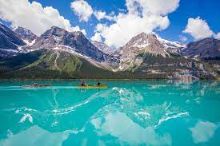
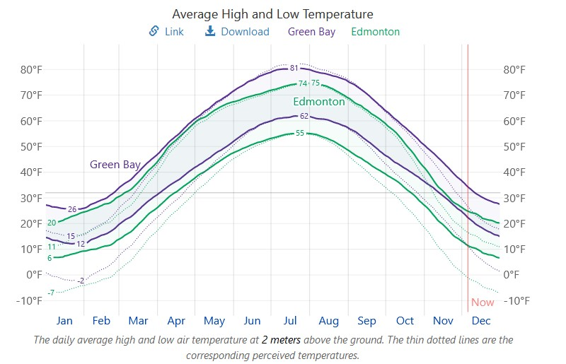
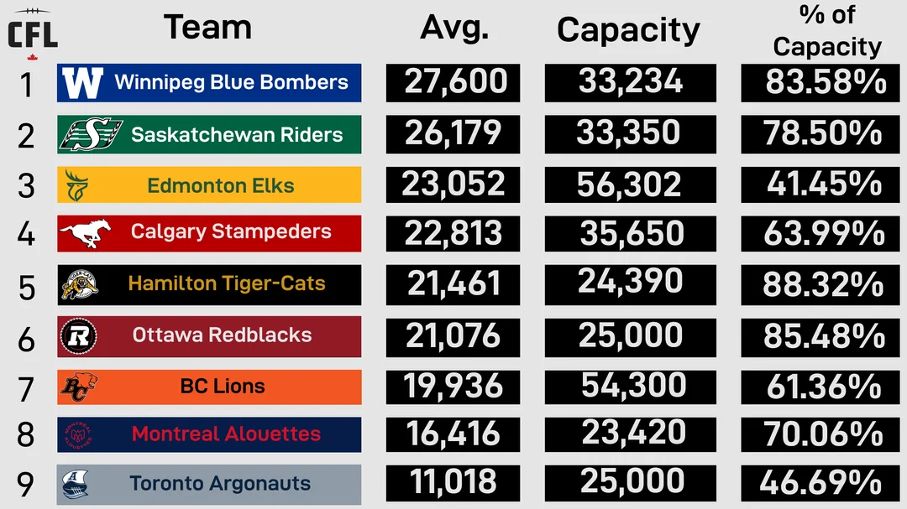

# NFL-Home
 
In this project, my goal is to use data analysis to determine where would be the best city to move or add a team to the NFL in order to maximize Home Field Advantage (HFA). I go through and break down the factors the attribute the teams with the best HFA. The data was obtained from ESPN through web scraping with BS4. I created team cards in PowerBI that are attached to a MySQL database to breakdown my findings. Screenshots can be found [here](https://github.com/JeffSinsel/NFL-Home/tree/main/team-cards) or checkout NFL-Home.pbix to see the dashboard. 

## Home Field Advantage
In order to determine HFA, I took every team's home win percentage - their away win percentage to account for team strength. The time frame for this is 2016 to 2022 because 2016 was the year where 4 teams started changing stadiums. Here is the graph of overall HFA for every team in the league: 

As you can see, HFA varies from year to but remains in approximately the 5% to 20% range barring pandemics. This is often times reflected in betting odds for NFL games where if two equal teams play, the home team is favored. 

To know what teams to look into, we need to break this down by team to find the largest HFAs which is shown here: 

This graph shows the [Dolphins](#dolphins) and [Packers](#packers) blowing away the league average of 11.2% HFA with 29% HFA and 25% HFA respectively. We also see the [Cardinals](#cardinals) who are significantly below 0% with **-8%** HFA showing a home field **disadvantage**. Lets dive in and see what makes an large (or negative) HFA.

## Dolphins
The Dolphins play at Hard Rock Stadium, located in Miami, Florida. Because of the location, Hard Rock Stadium hosts, on average, the hottest home games compared to the rest of the league. 

They take extra advantage of the climate by having the away team bench on the north of the stadium facing south. This makes the away bench bake in the sun while the home bench is comfortably in the shade as shown in the images below. 

Another small thing, the Dolphins wear white uniforms at home where traditionally the home team wears their primary color. This reduces the amount of sunlight the players absorb.

## Packers
The Packers play at Lambeau Field, located in Green Bay, Wisconsin. Lambeau Field is appropriately nicknamed "Frozen Tundra" because it is the exact opposite of Hard Rock Stadium. Lambeau Field hosts, on average, the coldest home games compared to the rest of the league. To add on to this, the average amount of snow in Green Bay is 562% league average.

This advantage kicks in harder in colder months when the playoffs occur, leading to a **21-6** home playoff record.

## Cardinals

The Cardinals play in State Farm Stadium, a domed stadium located in Glendale, Arizona. Because of the dome, the climate is as moderate as can be. Opposed to away teams playing in a climate they are not used to, they get to play in a comfortable dome. 

Another issue with the Cardinals is their lack of fans. In a 2022 study by Samford University, the Cardinals ranked 29th/32 in fan base size. When away fans can come in and "takeover" a stadium with noise, a home game becomes an away game.

## Where do you go
After going through these teams, we can determine the 3 most important things to get a large HFA:

### Climate
The teams with the largest HFAs use climate to their advantage. We proved that domes and moderate climate can diminish HFA. The optimal city for a team would have an outdoor stadium that can be added on or used as is. If we have to build a new stadium, that is possibly more money coming out of our pockets or a possible push from the league office to build an indoor stadium. 

### Fans
As proved by the Cardinals, fans or a market of fans is important is the bare minimum for a decent HFA. Ignoring HFA for a second, fans also account for about 40% for revenue, so having a large market is great for mutiple reasons. 

(Credit [Forbes](https://www.forbes.com/sites/mikeozanian/2022/08/22/nfl-team-values-2022-dallas-cowboys-are-the-first-franchise-worth-8-billion/))

The optimal city or region would have at least 150,000 people in market (The average NFL game has 68,000 fans). 

### Distance
In order to make sure that our team does not to get jetlagged or overtired from travel, the team would probably have to be in North America. However, the optimal region cannot be to close to another team in order to not poach fans. 

## Conclusion
Essentially, we need a large city, that has extreme weather, with an outdoor stadium, and close to the US.

We can eliminate the continental US because the extremes of the climate are already taken up. That leaves us with Canada and Mexico. 

Mexico City seems like a good location with high elevation similar to Denver, but elevation does not have the same effect as temperature. That is a good start, but there is a better answer. 

Canada has some extreme weather and large cites. We can eliminate Toronto, Winnipeg, and Vancouver for how close they are to current NFL teams (Buffalo, Minneapolis, and Seattle). Looking through Ottawa and Montreal, neither has a good outdoor stadium so they can get crossed off. That leaves us with the two major cities of Alberta, Edmonton and Calgary.

### Alberta

(Photo by <a href="https://unsplash.com/@andyjh07?utm_content=creditCopyText&utm_medium=referral&utm_source=unsplash">Andy Holmes</a> on <a href="https://unsplash.com/photos/body-of-water-near-tree-XZ8AiqUcbD8?utm_content=creditCopyText&utm_medium=referral&utm_source=unsplash">Unsplash</a>)

#### Climate

Alberta also has an extreme temperature similar to Green Bay, although Alberta does not get as much snow. The weather not much more extreme than Green Bay is actually advantage because there are pushes from the league office to have more indoor stadiums in colder climates. Below is a temperature graph comparing Green Bay (Purple) and Edmonton (Green) 

(Graph from [WeatherSpark](https://weatherspark.com/))

#### Fans

There are approximately 1 million people living in Edmonton, as well as Calgary's 1.4 million people. The market for football is definitely there with the Edmonton and Calgary Canadian Football League (CFL) teams being 3rd and 4th in attendance.

Edmonton is home to Commonwealth Stadium, the largest stadium in Canada with a 56,302 capacity. This could be renovated to add a couple thousand more seats to bring it up to NFL standards.

(Photo by Nathan Power on [Wikipedia](https://en.wikipedia.org/wiki/Commonwealth_Stadium#/media/File:CommonwealthStadium2023.jpg))

#### Distance 

Finally, the closeness to the US is not an issue because both Edmonton and Calgary have NHL teams which consistently travel to the US. 

#### Alberta Owls

Overall, the best place for a new or relocating NFL team is Edmonton. In order to capture the largest market possible, the team's official location will be Alberta. This is similar to how the New England Patriots play in Boston but have an official location of New England. 

The final piece of the equation is a great mascot. Alberta has plenty of options due to the beauty of the providence but in my opinion, the providence bird of the Great Horned Owls is the best. 

**Welcome to the NFL the Alberta Owls, who play at Commonwealth Stadium!** 

(Concept from [Pinterest](https://www.pinterest.com/pin/434738170279584389/))